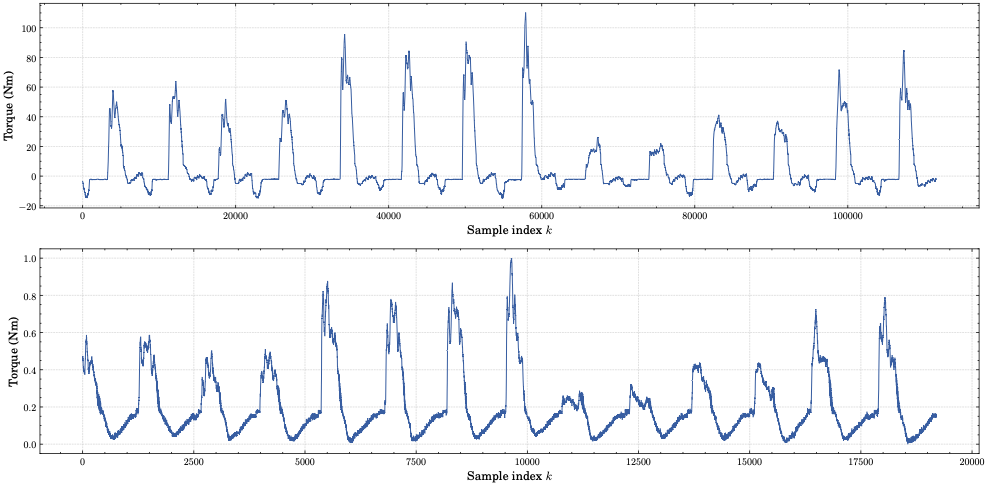
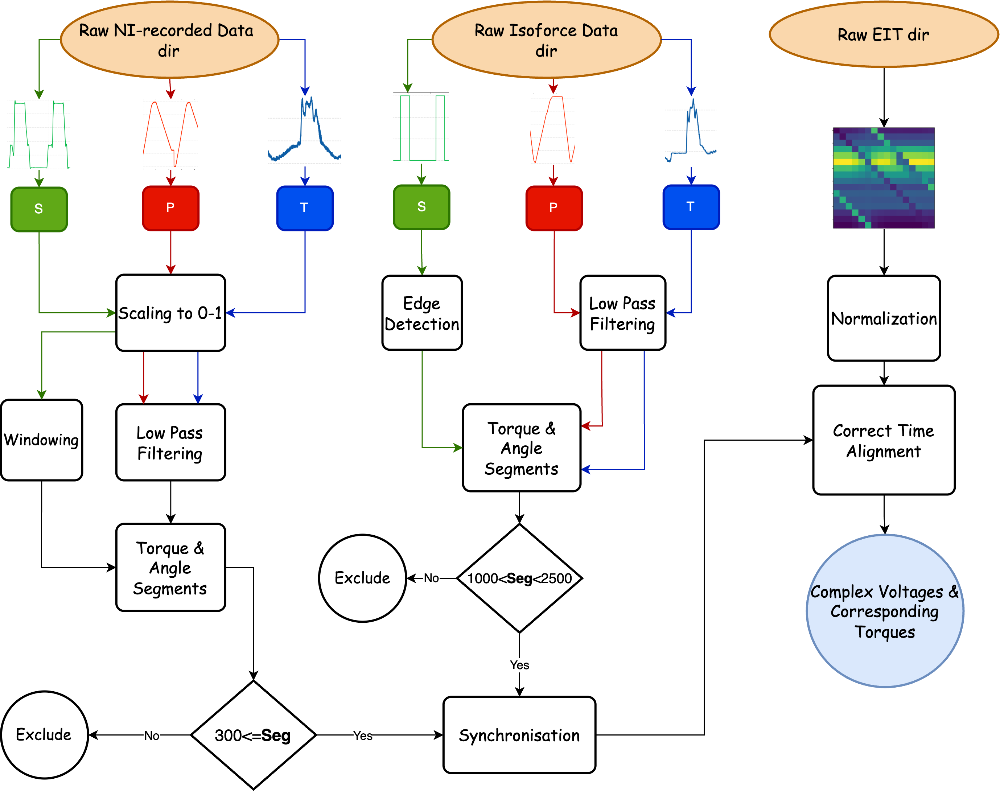
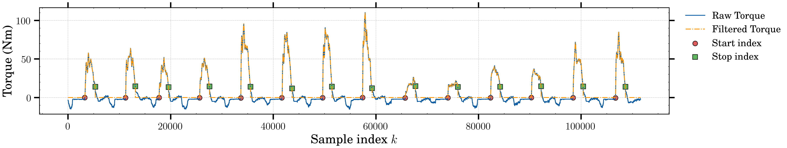
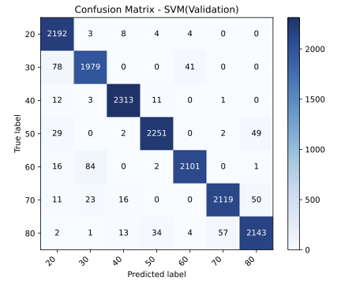
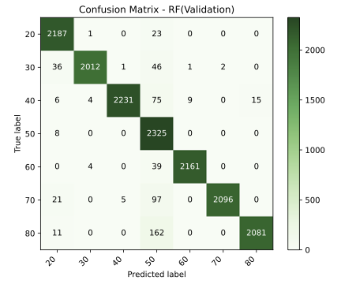

[](LICENSE)
[](https://www.python.org/downloads/)

<h1>
  
  EIT Thigh Force Estimation
</h1>

## Abstract

Assessing muscle strength and estimating muscle force during everyday activities plays a crucial role in understanding human movement, rehabilitation, and sports science.  
This project leverages **Electrical Impedance Tomography (EIT)** — a non-invasive imaging technique that captures the internal conductivity distribution of tissues — to explore the feasibility of **force level estimation** from EIT data.

Inspired by [*EITPose*](https://github.com/SPICExLAB/EITPose), which demonstrated real-time monitoring of forearm muscle activity using EIT, we extend this approach to the thigh region.  
A custom-built belt equipped with 16 electrodes was developed to record EIT data, while an Isoforce device simultaneously captured torque measurements.

The study is structured in two phases:
- Estimation of discrete force levels (20–80 Nm) across multiple participants.
- Continuous torque estimation, formulated as a regression problem.

---

## Table of Contents

- [Data Quality Check](notebooks/0.Data_Quality_Check.ipynb.PCA_Analysis.ipynb)
- [Data Preprocessing and Synchronization](notebooks/1.Synchronization_Data.ipynb)
- [Dataset Generation](notebooks/2.Dataset_generation.ipynb)
- [PCA Analysis](notebooks/3.PCA_Analysis.ipynb)
- [Classification](notebooks/4.Classification.ipynb)
- [Multi-Class Classification](notebooks/5.Multi-Class_Classification.ipynb)
- [Regression](notebooks/6.Regression.ipynb)
- [Outlook](#outlook)
- [Installation](#installation)
- [Author](#author)
- [Acknowledgements](#acknowledgements)

---

## Data Acquisition

The Data was acquired using the Sciospec and Isoforce devices. here the acquired data can be shown below:




## Data Preprocessing and Synchronization
After acquiring the data it passed through the preprocessing pipeline before used for trainng data-driven models. The overview of this pipeline shown below:


As an example for participant 5, this pipeline was applied to extract the relevant trials and remove the redundant area.

the results can be seen below:



## Classification Results

Two different models were utilized : SVM and Random Forest





## Regression Results

Random forest was applied to predict the continuous torques:
.png)

---

## Installation

Make sure you have **Python 3.8** or later installed.  
Clone the repository and install the required packages:

```bash
git clone https://github.com/Arash-Keshavarz/EIT_Thigh_Force_Estimation.git
cd EIT_Thigh_Force_Estimation
pip install -r requirements.txt
```

---

## Author

This repository was created and is maintained by Arash Keshavarz,
Institute of Communications Engineering, University of Rostock, Germany.

Contact: arashkeshavarzx@gmail.com

---

## Acknowledgements

- The EITPose project served as an inspiration for extending EIT applications to the thigh region.
- Special thanks to the Institute of Communications Engineering, University of Rostock, for their support.

# License
This project is licensed under the MIT License - see the [LICENSE](LICENSE) file for details.

## Contributing
Contributions are welcome! Please open issues or pull requests.